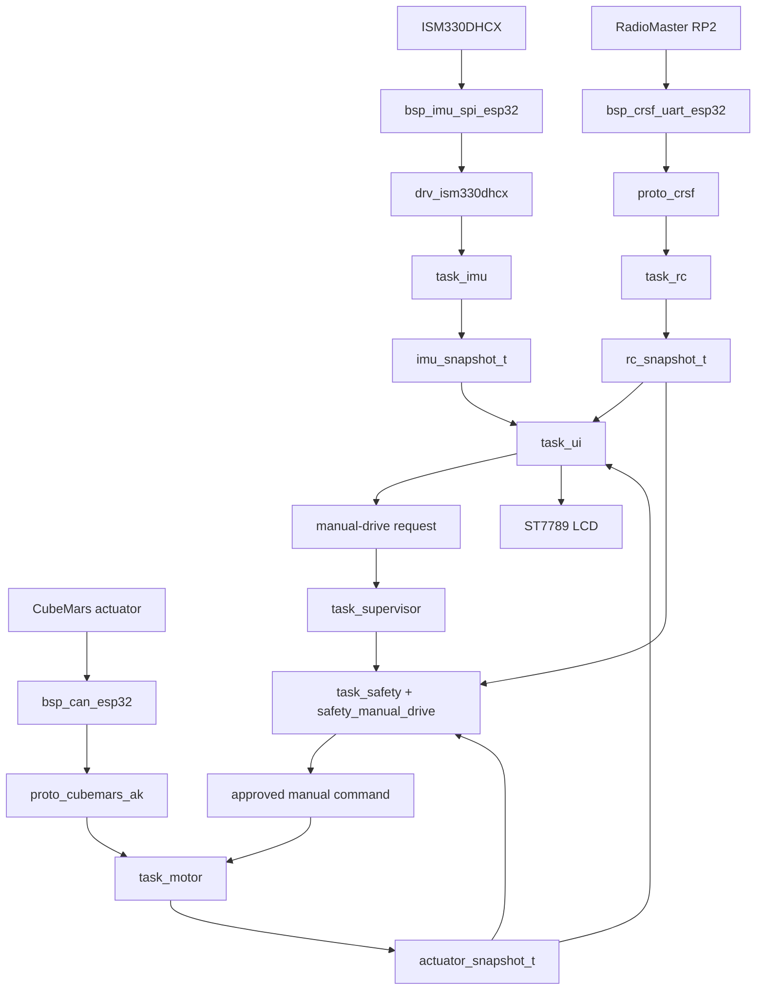

# Software guide and roadmap

## 1. Purpose

This document explains the current firmware, how the modules fit
together, where to make common changes, and the recommended software path
from the current ESP32 checkpoint to the final balancing robot.

The current firmware is a safe subsystem-integration and commissioning
baseline. It can:

- read, calibrate, mount-correct, and estimate attitude from an ISM330DHCX;
- receive and validate 16-channel CRSF data from a RadioMaster RP2;
- monitor four configurable CubeMars actuator slots over CAN;
- manually command one configured actuator in servo velocity mode;
- display RC, IMU, CAN, and manual-drive state on an ST7789 LCD; and
- pass every manual motor command through supervisor and safety ownership.

It does not yet balance the robot. There is no final balance controller,
balance-control task, actuator mixer, complete system-mode state machine,
persistent tuning service, or STM32 implementation of the ESP32 BSPs.

## 2. The main architectural idea

The firmware separates portable robot behavior from MCU-specific implementation.

```text
04_firmware/common/
    Portable C.
    No ESP-IDF, STM32 HAL, CubeMX, FreeRTOS, MCU pins, or board assumptions.

04_firmware/platforms/esp32/
    Active ESP-IDF application.
    Owns board pins, peripheral setup, FreeRTOS tasks, and startup.

04_firmware/platforms/stm32/
    Future STM32H723ZG target.
    Keeps CubeMX-generated code separate from user-owned app code.
```

The intended dependency direction is:

```text
FreeRTOS tasks and application glue
        |
        v
portable app, safety, UI, estimation, protocol, and driver modules
        |
        v
portable interfaces such as if_spi, if_display_io, and if_can
        ^
        |
platform BSP implementations
        |
        v
ESP-IDF now / STM32 HAL later
```

Common code must never include a platform header. Platform code may include
and use common code.

## 3. Repository organization

### `common/include/app` and `common/src/app`

Application-facing data types and portable glue.

- `app_imu_types.h` defines `imu_snapshot_t`.
- `app_rc_types.h` defines the 16-channel `rc_snapshot_t`.
- `app_actuator_types.h` defines four actuator feedback slots and CAN status.
- `app_manual_drive_types.h` defines requests, inhibit flags, and approved
  manual-drive state.
- `app_supervisor_types.h` defines the current whole-system modes.
- `app_balance_state.[ch]` converts checked IMU data into the smaller state
  expected by future balance control. It is retained but not linked into the
  current ESP32 image because no controller consumes it yet.

### `common/include/interfaces`

Small hardware-neutral contracts:

- `if_spi.h`: a generic full-duplex SPI transfer callback;
- `if_display_io.h`: command, data, reset, and delay operations for displays;
- `if_can.h`: a classic CAN frame independent of ESP32 TWAI and STM32 FDCAN.

These interfaces are the migration seam. An STM32 BSP should implement the
same interface instead of changing the common driver or protocol.

### `common/include/drivers` and `common/src/drivers`

Device-level logic:

- `drv_ism330dhcx` owns IMU registers, WHO_AM_I validation, sensor setup,
  raw reads, and conversion to SI units.
- `drv_st7789` owns LCD initialization, RGB565 storage, orientation, basic
  pixel/rectangle drawing, 2x scaling, and controller transfers.

The drivers know their device protocols but do not know ESP32 GPIO numbers,
SPI host numbers, or FreeRTOS.

### `common/include/protocols` and `common/src/protocols`

Wire-format code:

- `proto_crsf` consumes a byte stream, finds frames, verifies CRC, and
  unpacks all 16 packed 11-bit RC channels.
- `proto_cubemars_ak` packs CubeMars servo commands and decodes periodic
  servo feedback carried in extended classic CAN frames.

Protocol modules do not own UART or CAN peripherals.

### `common/include/estimation` and `common/src/estimation`

- `est_imu_mount` maps sensor axes into the robot body frame.
- `est_imu_calibration` accumulates stationary samples and removes gyro bias.
- `est_attitude` exposes a generic estimator API. The current implementation
  uses a 6DOF complementary filter. Madgwick, Kalman, and 9DOF values exist
  as architectural options but are not implemented behavior yet.

The body convention is:

```text
+X    robot forward
+Y    robot left
+Z    robot up
```

### `common/include/safety` and `common/src/safety`

- `safety_rc` checks presence, validity, freshness, and configured channel
  ranges.
- `safety_imu` checks validity, calibration, timestamp direction, freshness,
  attitude validity, tilt, and acceleration magnitude.
- `safety_manual_drive` is a state machine that decides whether a manual
  actuator command may be transmitted.

Safety code returns explicit status and inhibit flags. It does not touch
hardware and does not change the supervisor's whole-system mode.

### `common/include/ui` and `common/src/ui`

- `ui_rc_input` converts configurable RC channels into semantic events. It
  owns hysteresis, neutral re-arming, switch edge detection, link-loss
  behavior, and the SC input lock.
- `ui_state` owns page, selection, input-enabled state, and browse/interact
  behavior.
- `ui_canvas` provides device-independent RGB565 text and rectangle drawing.
- `ui_pages` formats snapshot data into STATUS, CRSF, IMU, and CAN pages.

The UI displays system state and requests actions. It does not approve motion
and cannot directly transmit a motor command.

### `platforms/esp32/include`

`board_esp32_nodemcu_v1.h` is the physical pin and peripheral map. Change a
GPIO, SPI host, SPI mode, UART, or peripheral clock here rather than inside a
driver or task.

### `platforms/esp32/main/bsp`

ESP-IDF peripheral implementations:

- `bsp_imu_spi_esp32`: SPI2 backend for `if_spi`;
- `bsp_display_spi_esp32`: SPI3, D/C, reset, and chunked display writes for
  `if_display_io`;
- `bsp_crsf_uart_esp32`: UART2 setup and buffered reads;
- `bsp_can_esp32`: TWAI setup, ISR receive callback, receive queue, transmit,
  bus status, error counters, and bus-off recovery.

BSP modules know the MCU peripheral API. They should not contain robot modes,
control calculations, UI state, or device protocol policy.

### `platforms/esp32/main/config`

The current editable application configuration is split by subsystem:

- `config_imu.h`: sampling, range, mounting, calibration, estimator, and IMU
  safety values;
- `config_rc.h`: active channel count, accepted raw range, freshness, and UART
  timing;
- `config_ui.h`: display orientation, UI task timing, channel assignments,
  threshold hysteresis, and input polarity;
- `config_actuator.h`: CAN timing, four motor IDs/enables, manual-drive channel,
  neutral band, command freshness, stop hold, polarity, and ERPM limit.

These files are platform application configuration. Common modules receive
the selected values through configuration structures and remain board-neutral.

### `platforms/esp32/main/tasks`

Each FreeRTOS task owns one long-running responsibility. Tasks publish current
state through snapshots protected by short ESP32 critical sections.

The snapshots are latest-value data. They are not event history. Consumers
copy the complete snapshot and then use its timestamp and validity fields.
The CAN receive path is different: frames enter a FreeRTOS queue because every
received frame must be processed.

## 4. Startup and task scheduling

`app_main()` starts the active tasks:

```text
task_imu
task_motor       when APP_ENABLE_ACTUATORS=1
task_rc          when APP_ENABLE_RC_RECEIVER=1
task_ui          when APP_ENABLE_UI=1
task_supervisor  when actuators, RC, and UI are all enabled
task_safety      when actuators, RC, and UI are all enabled
```

Current task timing and relative priorities:

| Task | Period or blocking interval | Priority | Responsibility |
| --- | ---: | ---: | --- |
| `task_safety` | 20 ms | idle + 4 | Approve or block manual motion |
| `task_imu` | 10 ms | idle + 3 | Read IMU and publish estimated attitude |
| `task_motor` | CAN read up to 20 ms; command cadence 20 ms | idle + 3 | Own CAN and actuator command transmission |
| `task_rc` | UART read up to 20 ms | idle + 2 | Parse and publish CRSF channels |
| `task_supervisor` | 20 ms | idle + 2 | Own whole-system mode |
| `task_ui` | 50 ms; render every 200 ms | idle + 1 | Handle UI input and update LCD |

This is appropriate for commissioning. The final balance loop will need a
deliberate fixed-rate execution design and measured timing; it should not be
inserted casually into the UI or motor receive loop.

## 5. Current data flow



## 6. What each task does

### `task_imu`

1. Publishes an invalid snapshot before hardware is ready.
2. Validates the configured sensor-to-body mounting axes.
3. Retries ESP32 SPI initialization until it succeeds.
4. Configures the ISM330DHCX for the selected ODR and full-scale ranges.
5. Collects 200 stationary samples for gyro-bias calibration.
6. Marks data invalid during calibration.
7. Converts raw measurements to SI units and maps them to the body frame.
8. Removes gyro bias.
9. Calculates `dt` from microsecond timestamps.
10. Updates the complementary attitude estimator.
11. Publishes raw data, converted data, bias, attitude, counters, validity,
    calibration state, and timestamp in one `imu_snapshot_t`.

Current settings are a 10 ms task period, 208 Hz sensor ODR, ±4 g
accelerometer, ±500 degrees/s gyro, and complementary-filter alpha 0.98.

### `task_rc`

1. Publishes an invalid snapshot before UART is ready.
2. Configures UART2 for CRSF at 420000 baud, 8N1, non-inverted.
3. Reads up to 64 bytes at a time.
4. Feeds every byte into the portable CRSF parser.
5. Publishes a snapshot only when a valid RC channel frame is complete.
6. Includes all 16 channels, timestamp, frame count, CRC errors, parser
   errors, UART errors, and validity.

CRSF uses 11-bit fields, but the accepted normal/extended control range is
172 through 1811. Safety currently checks only CH1 through CH10 because the
transmitter has ten active configured channels.

### `task_motor`

1. Creates four actuator slots from `config_actuator.h`.
2. Refuses to start if two enabled slots use the same CAN ID.
3. Starts ESP32 TWAI at 1 Mbit/s.
4. Receives portable `if_can_frame_t` frames from the BSP queue.
5. Accepts extended, non-remote CubeMars servo-feedback frames.
6. Maps the frame motor ID to a configured slot.
7. Decodes position, electrical RPM, current, temperature, and fault code.
8. Marks feedback stale after 100 ms or when the bus is off.
9. Publishes feedback, bus state, bus errors, queue overflow, decode errors,
   unknown IDs, recoveries, and transmit counters.
10. Requests TWAI recovery if the controller reaches bus-off.
11. Reads only the latest safety-approved manual command.
12. Transmits servo velocity at a 20 ms cadence only while that approval is
    fresh and the selected slot is enabled.
13. Sends zero velocity for the configured stop-hold window when approval is
    removed or expires.

Only actuator slot 1 is currently enabled, at decimal CAN ID 69. Slots 2-4
hold placeholder IDs 70-72 and remain disabled.

### `task_ui`

1. Builds RC and IMU safety-check configurations.
2. Initializes the portable RC input mapper and UI state machine.
3. Initializes the ESP32 display BSP and ST7789 driver.
4. Uses a 38,400-byte RGB565 logical framebuffer.
5. Reads the latest RC, IMU, actuator, and manual-drive snapshots.
6. Checks RC and IMU freshness for display and input gating.
7. Converts RC movement and switch edges into UI events.
8. Updates the locked/browse/interact state machine.
9. Renders STATUS, CRSF, IMU, or CAN data.
10. Publishes a timestamped manual-drive request when the UI is unlocked,
    on the CAN page, and in interact mode.

The UI always requests actuator index 0 today. The CAN page cannot yet select
another actuator because CH2 is reserved as the live velocity input while the
CAN page is in interact mode.

### `task_supervisor`

The supervisor currently has two modes:

```text
APP_SYSTEM_MODE_SAFE_IDLE
APP_SYSTEM_MODE_MANUAL_DRIVE
```

Every 20 ms it defaults to SAFE_IDLE. It enters MANUAL_DRIVE only when the
UI request is enabled, fresh, and references a valid actuator index. It
publishes the mode and selected actuator as a snapshot.

The supervisor decides the requested whole-system mode. It does not decide
whether the conditions are safe enough to move.

### `task_safety`

Every 20 ms it:

1. reads the supervisor, RC, and actuator snapshots;
2. converts supervisor mode into a manual-drive request;
3. checks RC validity, range, and freshness;
4. runs the portable manual-drive safety state machine;
5. publishes the resulting state and inhibit flags; and
6. sends the approved snapshot to `task_motor`.

## 7. Manual-drive safety chain

Motion requires all of the following:

- a fresh supervisor request for MANUAL_DRIVE;
- a valid and fresh RC snapshot;
- the requested actuator slot is configured;
- the CAN controller is initialized and error-active;
- actuator feedback is valid and fresh;
- actuator fault code is zero; and
- CH2 has passed through the configured neutral band before arming.

The state machine is:

```text
DISABLED
    No active request.

WAIT_SAFE
    Request exists, but a hard safety condition is not satisfied.

WAIT_NEUTRAL
    Hard conditions are acceptable, but the throttle must be centered or
    the user must cycle the request after a fault.

ARMED
    A bounded velocity command may be transmitted.

STOPPING
    Motion is no longer allowed, but explicit zero commands are held for
    500 ms.
```

The manual velocity limit is 1000 ERPM. UI requests expire after 150 ms.
Safety-approved motor commands expire after 100 ms. These independent
freshness checks prevent an old request or command from remaining active.

No motor command is sent automatically at boot.

## 8. Current UI behavior

Current channel mapping:

| Channel | Control | UI use |
| --- | --- | --- |
| CH1 | Ail | Previous/next page in browse mode |
| CH2 | Thr | Up/down selection; manual velocity on CAN DRIVE |
| CH6 | SD | Browse/interact switch |
| CH7 | SE | Enter event |
| CH10 | SC | Global UI input lock/enable |

SC must first be inactive and then transition active. This prevents an RC
receiver or transmitter that boots with SC high from immediately enabling
input. Stick axes must return to neutral before generating another event.
Holding a stick does not auto-repeat.

Pages:

- STATUS: RC and IMU health, age, roll, and pitch;
- CRSF: CH1-CH8 or CH9-CH16 plus parser counters;
- IMU: attitude/rate/calibration or acceleration/gyro/temperature;
- CAN: bus state, motor feedback, faults, and manual-drive state.

The display defaults to `DRV_ST7789_ORIENTATION_90`. Landscape uses a
160x120 logical canvas and portrait uses 120x160. Each logical pixel becomes
a 2x2 physical block on the 240x320 panel. The same page code handles all
orientations.

## 9. Common changes and where to make them

### Change a pin or peripheral assignment

Edit:

```text
04_firmware/platforms/esp32/include/board_esp32_nodemcu_v1.h
```

Do not put GPIO numbers into `common/`, a device driver, or UI page.

### Change an RC channel assignment

Edit the one-based channel numbers in:

```text
04_firmware/platforms/esp32/main/config/config_ui.h
04_firmware/platforms/esp32/main/config/config_actuator.h
```

`config_ui.h` maps UI actions. `config_actuator.h` independently maps the
manual velocity channel. Keep this distinction because UI navigation and
motion authority are different concerns.

### Change IMU mounting or estimator settings

Edit `config_imu.h`. Use the `EST_IMU_AXIS_SENSOR_*` values to define which
sensor axis points toward robot forward and robot up. Do not reorder axes in
`task_imu` or the sensor driver.

### Change motor IDs or enable another slot

Edit `config_actuator.h`. Every enabled motor must have a unique verified
physical ID. Do not change protocol IDs inside `proto_cubemars_ak`.

### Change display orientation

Edit `APP_DISPLAY_ORIENTATION` in `config_ui.h`.

### Add a UI page

1. Add the page enum to `ui_types.h` before `UI_PAGE_COUNT`.
2. Add its selection count in `ui_state.c`.
3. Render the page in `ui_pages.c`.
4. Extend `ui_page_model_t` only if a new snapshot is required.
5. Have `task_ui` collect that snapshot.
6. If Enter requests an action, publish an explicit request to the owning
   service or supervisor. Do not perform the action inside `ui_pages`.

### Add a new device

1. Define a small portable interface only if no suitable one exists.
2. Put device register/protocol logic in `common/drivers` or
   `common/protocols`.
3. Implement the MCU peripheral in the platform `bsp` folder.
4. Put physical pins in the board header.
5. Give one platform task or service ownership of the device.
6. Publish a timestamped snapshot for latest state or use a queue for events
   that must not be missed.

### Add control code

Control calculations belong under `common/control`. The FreeRTOS scheduling
and platform snapshot exchange belong in a platform `task_control`. Control
must produce desired commands, not write CAN directly. Safety must approve
the desired commands before `task_motor` transmits them.

## 10. Important current limitations

- Only one actuator is enabled and manually selectable.
- Only servo velocity transmission is used by the runtime motor task.
- MIT mode is not implemented.
- CAN page actuator selection is not implemented.
- The supervisor has only SAFE_IDLE and MANUAL_DRIVE modes.
- IMU safety is calculated for display, but it is not part of the current
  manual-drive gate.
- There is no final balance-control mode or controller.
- There is no RC command shaping for requested speed or steering.
- There is no actuator role, direction, gear ratio, or wheel mapping.
- There is no persistent parameter storage or validated tuning transaction.
- There is no deadline monitor, task watchdog policy, or control overrun
  counter.
- There is no structured runtime log or telemetry capture for controller
  tuning.
- STM32 currently contains generated startup and an empty user application
  hook; the active subsystems have not been ported.
- Common logic has no automated host unit-test target yet.

## 11. Recommended software roadmap

### Step 1: Add host-side tests for portable modules

Create a small CMake test target outside both MCU platforms. Test CRSF
parsing, CubeMars packing/decoding, freshness boundaries, manual-drive state
transitions, UI input hysteresis, estimator validity, and future control
math. Keep hardware bring-up tests out of the final application image.

Completion condition: portable tests run on macOS with one command and are
required before merging control changes.

### Step 2: Complete the four-actuator software model

Add a portable actuator role and direction configuration. Use meaningful
roles based on the final mechanism rather than referring only to M1-M4.
Add direction, command scaling, and feedback scaling without embedding robot
geometry in the CAN protocol.

Completion condition: all four unique IDs can be enabled, feedback maps to
the correct role, and sign conventions are documented and verified.

### Step 3: Finish a deliberate commissioning/service mode

Allow the CAN UI page to select exactly one actuator while motion is off.
Require selection confirmation, neutral input, and a fresh enable sequence
before motion. Preserve the current supervisor and safety chain.

Completion condition: each actuator can be selected and driven individually,
but no combination of page navigation or stale RC data can start motion.

### Step 4: Generalize the desired-command boundary

Replace the motor task's dependency on a manual-drive-specific command with
a generic safety-approved actuator command snapshot. Include timestamp,
validity, mode, per-actuator command, and explicit disabled state. Keep servo
velocity implemented first; add MIT or current/torque fields only after the
final control mode is selected.

Completion condition: manual commissioning and future balance control use
the same `control -> safety -> motor` ownership chain.

### Step 5: Expand the supervisor state machine

Introduce explicit states such as:

```text
BOOT
CALIBRATING
SAFE_IDLE
SERVICE
BALANCE_READY
BALANCING
FAULT
```

Define allowed transitions and entry/exit actions. UI and RC may request a
transition; only the supervisor changes system mode. Any unsafe or stale
condition must return to a non-moving state.

Completion condition: every operating mode and transition is explicit,
observable, and testable.

### Step 6: Build the final safety manager

Combine mode, IMU, RC, all required actuator feedback, command freshness,
tilt, driver faults, control-loop health, and future platform safety inputs
into a single permission result. Keep fault flags latched where investigation
is required and define deliberate recovery/re-arm behavior.

Completion condition: motor tasks can transmit nonzero robot commands only
from a fresh safety-approved snapshot, and every denial has a reason code.

### Step 7: Implement portable command shaping and balance control

Add portable modules for:

- RC deadband, scaling, rate limiting, and requested velocity/steering;
- balance state extraction;
- inner pitch stabilization;
- outer velocity/position behavior if required;
- steering/yaw contribution; and
- actuator mixing and saturation.

Start with the smallest controller supported by the thesis model. Keep
controller state and parameters in explicit structs. Avoid globals in common
control code.

Completion condition: the controller can be simulated and unit-tested from
recorded or generated inputs without ESP32 or FreeRTOS.

### Step 8: Add a deterministic control task

Create `task_control` to read synchronized fresh state, execute control at a
fixed measured rate, and publish desired commands. Add cycle timestamp,
execution time, overrun count, input age, output saturation, and validity.
Do not render UI, parse protocols, perform blocking I/O, or transmit CAN from
the control task.

Completion condition: timing is measured under full IMU, RC, CAN, and LCD
load with no missed control deadlines.

### Step 9: Add safe tuning and configuration services

Add a configuration service with working, pending, validated, and persisted
values. The UI edits pending values; the control module validates ranges;
an explicit action applies or saves them only in a safe non-moving mode.
Include configuration version and defaults recovery.

Completion condition: gains can be adjusted and restored without UI code
writing controller globals or corrupting persistent configuration.

### Step 10: Add focused logging and replay

Record timestamped controller inputs, outputs, mode, safety flags, saturation,
and loop timing at a controlled rate. Prefer a bounded buffer and export path
over continuous verbose serial printing. Provide a host tool that can plot or
replay a run through portable control code.

Completion condition: a balancing attempt can be explained afterward without
changing real-time behavior or relying on scrolling serial text.

### Step 11: Port the platform layer to STM32H723ZG

Keep common code unchanged. Implement STM32 BSPs for IMU SPI, LCD SPI, CRSF
UART, FDCAN, time, and any storage/safety inputs. Recreate task ownership and
priorities with CMSIS-RTOS2/FreeRTOS. Keep CubeMX-generated files separate
from user-owned `app`, `bsp`, `tasks`, and `config` files.

Completion condition: the same portable tests pass, the STM32 build uses
CMake/Ninja/arm-none-eabi-gcc, and subsystem snapshots match ESP32 behavior.

### Step 12: System validation and release cleanup

Run software-in-the-loop, bench, restrained, low-authority, fault-injection,
and endurance tests. Verify stale sensors, RC loss, CAN bus-off, motor faults,
task overruns, invalid configuration, and resets. Freeze configuration,
remove commissioning-only build paths from the release profile, and tag the
thesis release.

Completion condition: requirements, test evidence, configuration, firmware
revision, and known limitations are traceable for the final robot.

## 12. Recommended immediate next action

Do Steps 1 and 2 next:

1. add the host-side portable test target; then
2. add actuator roles/directions and commission all four feedback paths.

Do not begin tuning a balance controller until all actuator identities,
directions, feedback signs, freshness behavior, and stop behavior are known.
That information becomes the contract used by the mixer, safety manager, and
controller.

## 13. Build and monitor

From the repository root:

```bash
. ~/esp/esp-idf-v5.5/export.sh
cd 04_firmware/platforms/esp32
idf.py build
idf.py -p /dev/cu.usbserial-XXXX flash monitor
```

Exit the ESP-IDF monitor with `Ctrl+]`.

STM32 currently builds through:

```bash
cd 04_firmware/platforms/stm32
cmake --preset Debug
cmake --build --preset Debug
```

The STM32 application hook intentionally creates no tasks until subsystem
backends are migrated.

## 14. Rules to preserve

- Supervisor owns whole-system mode.
- Safety owns permission to move.
- Control computes desired commands.
- Motor tasks transmit only fresh safety-approved commands.
- UI requests actions but never enables torque or writes motor commands.
- Hardware-owning tasks publish snapshots; consumers do not access the
  peripheral directly.
- Latest state uses snapshots with timestamp, validity, freshness, and fault
  information.
- Events that must not be missed use queues.
- Common code remains independent of ESP-IDF, STM32 HAL, CubeMX, FreeRTOS,
  board pins, and target-specific headers.
- Generated STM32 code remains separate from user-owned code.
- New abstraction is added only when it creates a real platform or ownership
  boundary.
